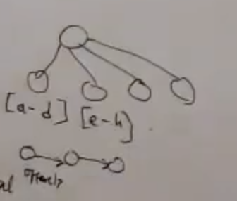

# Database indexes
Index allow to fetch data at faster way. 
- There is always an key
- Retrieval is always based on key
- 99% time; key is based on hashed index
Following is sample user table

| UserId        | Name          | Email         |
| ------------- |:-------------:| -------------:|
| 001           | Dilip Kumar   | abc@gmail.com |
| 002           | centered      |   $12         |
## Hash Index
- Hash map on disk
- Contains hash key and offset
- Key match is based on exact match
- You can create separate hash map for UserId, Name or Email as per requirement

Based on the key, get the offset and use that offset to get the data from main table.

| Key           | offset        |
| ------------- |:-------------:|
| 001           | 0             |
| 002           | 512           |

## B Tree indexes
- This is typically used when you don't have exact value of data you are trying to retrieve
- Also for range based retrieval 
- B tree indexes are organized as n way search tree similar to binary search tree
- Every node tree contains the range of key
- Leaf node contains the offset of each record
- Leaf node will have pointers to other leaf node; to follow more result

## Combination index
- This is used when you will have multiple criteria to retrieve data
- For example for few you have exact match but for few you have fuzzy match
- For example, retrieval based on location and name
location = US
name = ['a', 'b','c']
- You can have separate B Tree index for US location or other location 

